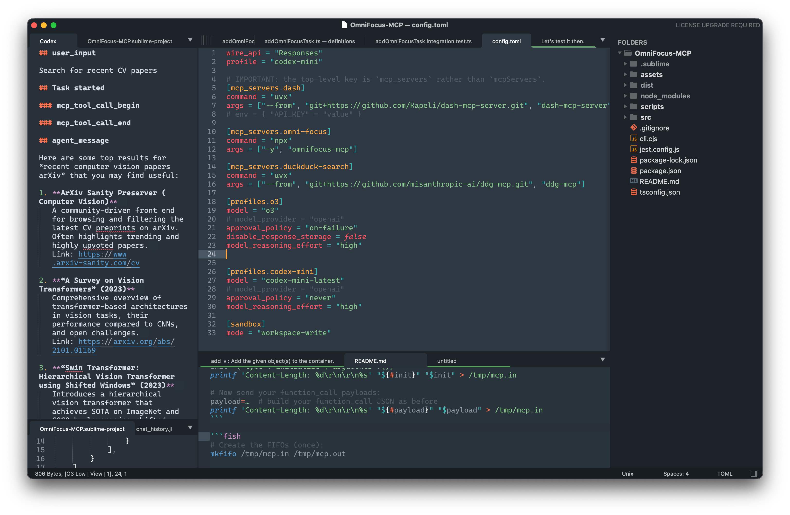

# Codex Sublime Text plug-in

Chat with the [Codex CLI](https://github.com/openai/codex) directly from Sublime Text.
The plug-in spins up a `codex proto` subprocess, shows the conversation in a
Markdown panel and lets you execute three simple commands from the Command
Palette.

---



## Features

- Full Codex capabilities
    - Assistant-to-Bash interaction
    - Sandboxing (on macOS and Linux)
    - Model and provider selection
- MCP support (via `~/.codex/config.toml`)[^1]
- Deep Sublime Text integration
    - Multiline input field uses Markdown
    - Selected text is auto-copied into the message with syntax applied
    - Outputs to either the output panel or a separate tab
    - Symbol list included in answers
- Works out of the box[^2].

## Installation

1. **Install the Codex CLI** (the plug-in talks to the CLI, it is **not** bundled).

   ```bash
   npm i -g @openai/codex   # or any recent version that supports `proto`
   ```

   By default the plug-in looks for the binary at:

   * macOS (Homebrew): `/opt/homebrew/bin/codex`

If yours lives somewhere else, set the `codex_path` setting (see below).  From
vX.Y on, `codex_path` can also be an *array* of command tokens – handy on
Windows where you might want to launch through WSL:

```jsonc
// "Codex (Windows).sublime-settings" – Sublime Text will automatically pick
// the platform-specific default when you open *Preferences ▸ Package Settings ▸ Codex ▸ Settings* on Windows.
{
  "codex_path": ["wsl", "-e", "codex"],
  "token": "sk-..."
}
```

Suppressing noisy events
-----------------------

If the Codex backend floods the transcript with incremental updates such as
`agent_reasoning_delta`, add them to the `suppress_events` array in your
project-specific `codex` settings:

```jsonc
{
  "suppress_events": ["agent_reasoning_delta"]
}
```

2. Plugin installation
    1. With Package Control
        1. `Package Control: Add Repository` → `https://github.com/yaroslavyaroslav/CodexSublime`  
        2. `Package Control: Install Package` → **Codex**

    2. Manual
        Clone / download into your `Packages` folder (e.g. `~/Library/Application Support/Sublime Text/Packages/Codex`).

That’s it – no settings file required.

3. **Create an OpenAI token** and tell the plug-in about it.

   *Open the menu* → **Preferences › Package Settings › Codex** and put your
   key into the generated `Codex.sublime-settings` file:

   ```jsonc
   {
       // where the CLI lives (override if different)
       "codex_path": "/opt/homebrew/bin/codex",

       // your OpenAI key – REQUIRED
       "token": "sk-…"
   }
   ```

That’s it – hit <kbd>⌘⇧P</kbd> / <kbd>Ctrl ⇧ P</kbd>, type *Codex*, select one of
the commands and start chatting.

---

## Commands (⌘⇧P)

• **Codex: Prompt** – open a small Markdown panel, type a prompt, hit *Super+Enter*.

• **Codex: Open Transcript** – open the conversation buffer in a normal tab.

• **Codex: Reset Chat** – stop the Codex subprocess, clear the transcript and
  invalidate the stored `session_id` so the next prompt starts a brand-new
  session.

---

## Per-project configuration

Every Sublime project can override Codex settings under the usual `settings`
section.  Example:

```jsonc
{
    "folders": [{ "path": "." }],

    "settings": {
        "codex": {
            // will be filled automatically – delete or set null to reset
            "session_id": null,

            // model & provider options
            "model":            "o3",
            "provider_name":    "openai",
            "base_url":         "https://api.openai.com/v1",
            "wire_api":         "responses",
            "approval_policy":  "on-failure",

            // sandbox
            "sandbox_mode": "read-only",
            "permissions": [
                // additional writable paths (project folders are added automatically)
                "/Users/me/tmp-extra"
            ]
        }
    }
}
```

---

## Writable paths passed to Codex

The plug-in constructs the `sandbox_policy.permissions` list for each session:

1. `/private/tmp`
2. **`cwd`** – the first project folder (or the current working directory if
   there is none)
3. **All folders** listed in the Sublime project (visible in the sidebar)
4. Any extra paths you add via `settings.codex.permissions`

Those paths are sent to the CLI unchanged; Codex is free to read/write inside
them depending on the selected `sandbox_mode`.

---

## Default configuration sent to the CLI

The first thing the bridge does is send a `configure_session` message:

```jsonc
{
    "id": "<session_id>",
    "op": {
        "type": "configure_session",

        // model / provider
        "model":            "codex-mini-latest",
        "approval_policy":  "on-failure",
        "provider": {
            "name":     "openai",
            "base_url": "https://api.openai.com/v1",
            "wire_api": "responses",
            "env_key":  "OPENAI_API_KEY"
        },

        // sandbox
        "sandbox_policy": {
            "permissions": [
                "disk-full-read-access",
                "disk-write-cwd",
                "disk-write-platform-global-temp-folder",
                "disk-write-platform-user-temp-folder",
                {
                    "disk-write-folder": {"folder": "$HOME/.cache"} // for clangd cache
                }
            ],
            "mode": "workspace-write"
        },

        "cwd": "<cwd>"
    }
}
```

All values can be overridden per-project as shown above.

Enjoy hacking with Codex inside Sublime Text!  🚀

## Code sent to the language model

The plugin only sends the code snippets that you explicitly type or select in the input panel to the language model. It never uploads your entire file, buffer, or project automatically. Local configuration (such as sandbox permissions or project folders) is used only by the CLI to enforce file I/O rules and is not included in the prompt context.

However keep in mind that since this plugin and tool it relays on is agentish, any data from within your sandbox area could be sent to a server.

[^1]: https://github.com/openai/codex/blob/main/codex-rs/config.md#mcp_servers
[^2]: If both requirements are met (1) `codex` is installed and (2) token in settings is provided.

